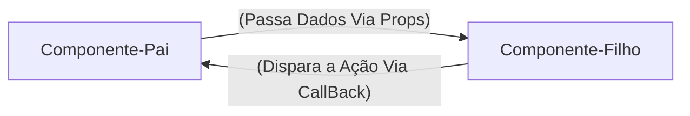

# REACT -Guia Rápido e Anotações

**Unidade Curricular:** Desenvolvimento FrontEnd
**Conteúdo:** Desenvolvimento de Frameworks - REACT

## Semana 1 - Introdução ao React e Ambiente de Desenvolvimento

### 1. O que é React?

- Uma biblioteca JavaScript para criação de interface de usuário (UI).
- Funciona de forma **declarativa**, você descreve o resultado esperado com base nos dados, eo React atualiza o navegador.
- Cria *SPAs* (Single Page Applications), atualizando partes da tela sem recarregar a página inteira.

### 2. React vs JavaScript Vanilla: SOM Tradicional vs Virtual DOM

O DOM no JavaScript tradicional é imperativo, procurando uma tag para mudar o componente e atualizar a página.

O React (Declarativo): UI é o componente (dados), quando os dados mudam, o React atualiza o componente.

### 3. Comandos Essenciais no Terminal

```bash

    #Criar projeto com o VITE (framework react)
    npm create vite@latest nome-projeto --template react

    #Atualizar e intalar dependências do node_modules
    npm install

    #Iniciar o servidor local (http://localhost:5173)
    npm run dev

```

```jsx

    //src/App.js
    //Componente raiz da Aplicação
    function App() {
        const sistema = "Meu Site";

        return (
            <main>
                <h1>{sistema}</h1>
                <p>Gerencie seus componentes em um só lugar!</p>
            </main>
        );
    }

    export default App;

```

> OBS: O JSX exibe **uma única tag raiz** (ou fragmento `<> ... </>`) e nomes de componentes sempre começam com a letra **Maiúscula** (UpperCamelCase).

---

## Semana 2 - JSX, Componetes, Props e Eventos 

### 1. Responsabilidade Única (SOLID)
- Quebrar a tela em componentes pequenos. Cada componente deve fazer uma única coisa bem feita:

**Exemplo de Componentes:**
- `Header`: Cuida do título e do cabeçalho da aplicação.
- `Footer`: Cuida do rodapé da aplicação.
- `NavBar`: Cuida da barra de navegação.

> OBS: O principio do Solid estabelece que uma unidade de software deve ter apenas um motivo para mudar.

### 2. Props: Passagem de Dados e Fluxo Unidiferecional

**O que são Props?**

Os Props são argumentos ou parâmetros das funções, sendo que um componete React é uma função JavaScript, ou seja, as Props (abreviação de properties) permitem que o componete pai envie dados dinâmicamente para o componete filho, tornando-o customizável e reutilizável.

### 3. Eventos e Comunicação via Callbacks

O Recat tem o encapsulamento de eventos nativos em objetos, e sua diferença para o HTML é a sintaxe.
- No HTML: `onclick="minhafuncao()"`
- No React JSX: `onClick={minhaFuncao}`

> OBS: Funções em JavaScript devem seguir o padrão LawerCamelCase de escrita.



### 4. Lista Dinâmicas com Map() e a Propriedades `Key`

**Porque Arrays São Estruturas Padrão do frontEnd?**

Os dados chegam de banco de dados e APIs no formato de coleção (Json), o método `.Map()` percorre cada item de uma array e retorna um novo componente JSX.

Exemplo:

```jsx
tarefas.map((tarefa) => (
    <TarefaItem
        key={tarefa.id}
        id={tarefa.id}
        titulo={tarefa.titulo}
        descricao={tarefa.descricao}
        completa={tarefa.completa}
    />
))

```

**Porque o react Exige `Key` no Uso do `.map()`**

O React quando renderiza uma lista precisa saber de forma inequívoca qual item específico foi adicionado, alterado ou removido. Se a chave for omitida, o react emite um aviso no console: `Warning: Each child in a list should have a unique "key" prop`.

> OBS: Evitar o índice do array como chave `(key={index})`, pois o índice do vetor não é fixo, use sempre uma chave única para os itens da lista (carimbo de data e hora, id único, etc).

### Componentes de Formulário Estático:

Criando o Arquivo `TarefaForm.jsx`