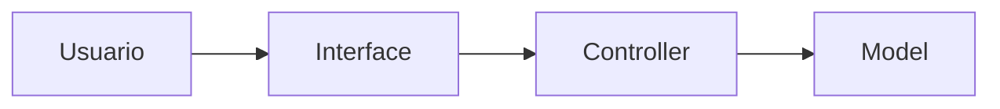
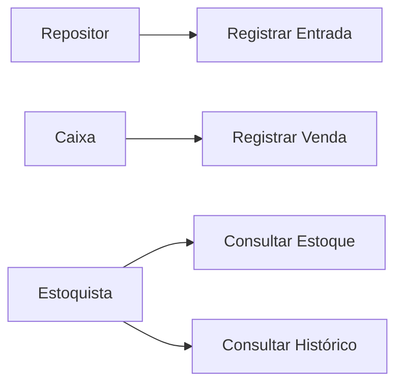
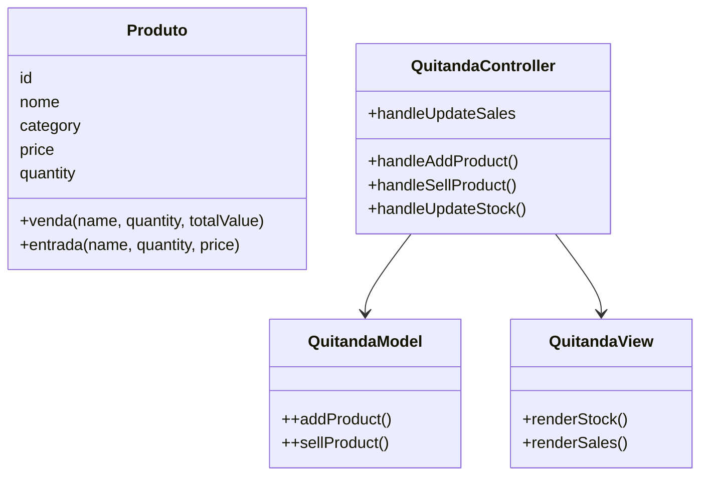
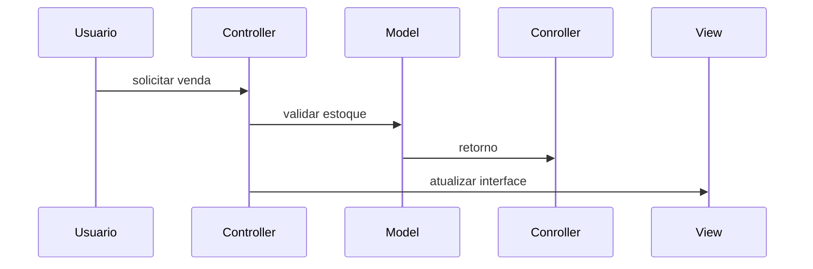
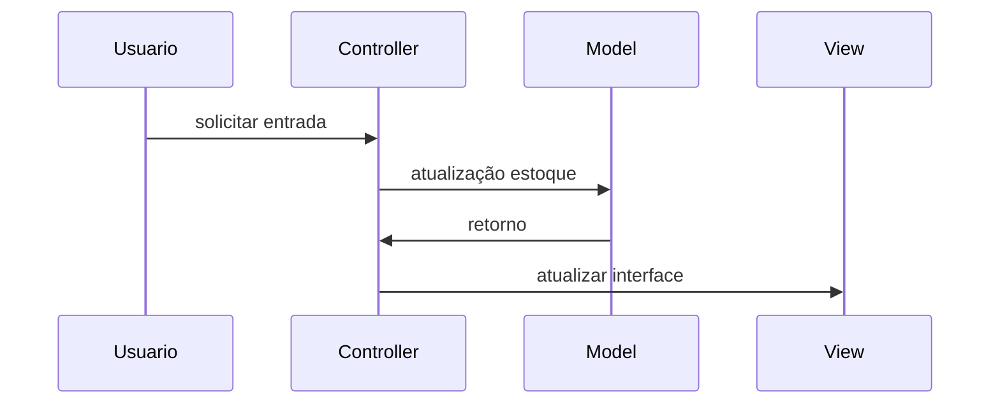
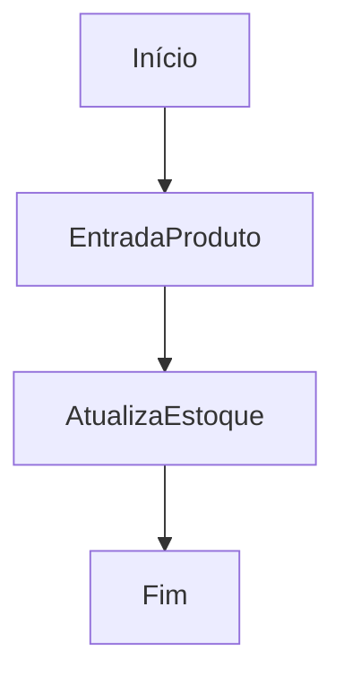
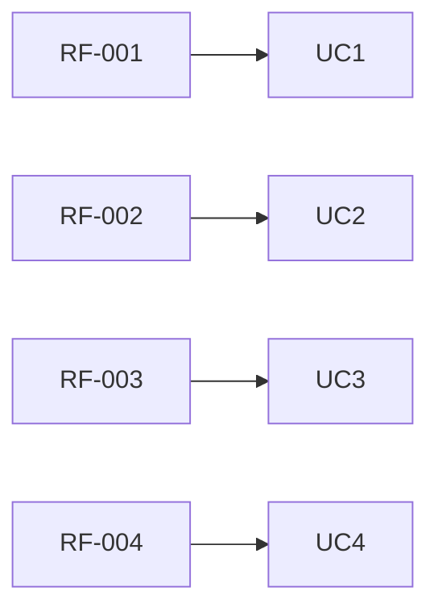

# Documentação de Especificações de Requisto de Software (SRS)
Documento baseado na ISO/IEEE 29148:2018

## Sistema de Controle de Quitanda (Quitanda MVC)

**Padrão:** ISO/IEC/IEEE 29148:2018
**Versão:** 1.0.0
**Data:** 2026-04-14
**Autor:** DiogoTB

---

## 1. Introdução

### 1.1 Propósito

Este documento descreve os requisitos do sistema **Quitanda MVC**, com o objetivo de:
* Definir funcionalidades
* Padronizar entendimento entre stakeholders
* Servir como base para desenvolvimento e testes

---

### 1.2 Escopo

O sistema permitirá:
* Registro de entrada de produto
* Registro de vendas
* Controle de estoque
* Histórico de movimentações

O sistema será uma aplicação web frontend utilizando:
* HTML
* CSS
* JavaScript
* Arquitetura MVC
* Estrutura POO

---

### 1.3 Definições

| Termo   | Definições |
| ------- | ---------- |
| Produto | Item comercializado na quitanda |
| Entrada | Registro de chegada de produto |
| Venda   | Registro de saída de produto |
| Estoque | Quantidade disponivel de produtos |

Acrônimos

* **SGQ** -  Sistema de gestão de Quitanda
* **RF** - Rquisito Funcional
* **RNF** - Requisito Não-Funcional

---

### 1.5 Visão Geral do Documento

Este documento esta organizado em:
* Visão geral
* Descrição do sistema
* Requsitos detalhados 
* Modelos UML
* Regras de negócio

---

## 2. Descrição Geral do Sistema

### 2.1 Perspectiva do Sistema

O sistema é standalone (frontend), operado em navegador

---

### 2.2 Funções do Sistema

O sistema deve:
* Cadastrar produtos
* Atualizar estoque
* Registrar estoque
* Validar operações
* Exibir dados

--- 

### 2.3 Classes de Usuários

| Usuários    | Descrição    |
| --- | --- |
| Dono | Gerenciamento de estoque |
| Caixa | Resaliza vendas |
| Repositor | Registra entradas |

---

### 2.4 Ambiente Operacional

* Navegador web (Chrome, Edge, Firefox)

---

### 2.5 Restrições

* Não utiliza banco de dados
* Dados armazenados na memória
* Sem autenticação de usuário

---

### 2.6 Suposições 

* Usuário possui conhecimentos básico de informática
* Volume de dados pequeno

---

## 3. Requisitos do Sistema

### 3.1 Requisitos Funcionais

#### RF-001: Cadastro de Produtos

**Descrição:** Permitir cadastrar um produto

- **Prioridade:** Alta
- **Versão:** 1.0
- **Data:** 2026-04-14
- **Rastreabilidade:** Necessidade do Stakeholder 001

**Critérios de Aceitação:**
- [ ] Entrada de Dados: Nome, Categoria, Preço, Quantidade
- [ ] Validação de Campos
- [ ] Varificação de Duplicidade
- [ ] Saída: Notificação ao Usuário

---

#### RF-002: Atualizar Estoque

**Descrição:** Permitir atualização de dados de itens existentes

- **Prioridade:** Alta
- **Versão:** 1.0
- **Data:** 2026-04-14
- **Rastreabilidade:** Necessidade do Stakeholder 002

**Critérios de Aceitação:**
- [ ] Verificação de Itens Cadastrados
- [ ] Entrada de Dados: Nome, Categoria, Preço, Quantidade
- [ ] Validação de Campos 
- [ ] Saída: Notificação ao Usuário

---

#### RF-003: Listagem de Estoque

**Descrição:** Exibir informações dos produtos cadastrados

**Prioridade:** Alta
**Versão:** 1.0
**Data:** 2026-04-14
**Rastreabilidade:** Necessidade do Stakeholder 003

**Critérios de Aceitação:**
- [ ] Listagem dos Produtos
- [ ] Saída: Id, Nome, Categoria, Preço, Quantidade

---

#### RF-004: Registro de Vendas

**Descrição:** Permitir vender produtos

**Prioridade:** Alta
**Versão:** 1.0
**Data:** 2026-04-14
**Rastreabilidade:** Necessidade do Stakeholder 004

**Critérios de Aceitação:**
- [ ] Venda de Produtos Cadastrados
- [ ] Verificação de Quantidade
- [ ] Atualização do Estoque
- [ ] Notificação de Venda Realizada

---

#### RF-005: Histórico de Movimetações

**Descrição:** Permitir o registro de movimentações (entrada e saída) de produtos

**Prioridade:** Média
**Versão:** 1.0
**Data:** 2026-04-14
**Rastreabilidade:** Necessidade do Stakeholder 005

**Critérios de Aceitação:**
- [ ] Registro das Movimentações em uma Lista
- [ ] Consulta das Movimentações
- [ ] Verificação de Duplicidade
- [ ] Saída: Notificação ao Usuário

---

### 3.2 Requisitos Não Funcionais

#### RFN-001: Usabilidade

**Descrição:** Interface simples e intuitiva

---

#### RFN-002: Desempenho

**Descrição:** Respostas rápida e inferiores a 1 segundo

--- 

#### RFN-003: Arquitetura MVC

**Descrição:** Estruturação da arquitetura do código em MVC

--- 

#### RFN-004: Confiabilidade

**Descrição:** Validação de entrada de dados obrigatória

---

## 4. Regras do Negócio

Tabela de Regras de Negócio 

| Regras de Negócio | Descrição |
| --- | --- |
| RN-001 | Quantidade de produtos não pode ser negativa|
| RN-002 | Preço do produto não pode ser negativo |
| RN-003 | Nome do produto é obrigatório|
| RN-004 | A venda só poder ser ealizada se o estoque for suficiente |
| RN-005 | Toda movimentação deve ser registrada |

---

Podem Existir restrições para o negócio (legais, movimentação, local)

## 5. Modelos do Sistema

### 5.1 Diagrama de Casos de Uso

Diagrama de Casos de Uso: O que o sistema deve fazer do ponto de vista do usuário

### 5.2 Diagrama de Classes UML 

Diagrama de Classes UML: Estrutura de código, classes, atributos e métodos

### 5.3 Diagrama de Sequência

Diagrama de Sequência: Interação entre objetos ao longo do tempo para realização de uma funcionalidade específica

#### 5.3.1 Venda

#### 5.3.2 Atualizações de Estoque

### 5.4 Diagrama de Atividades

Diagrama de Atividades: Fluxo de atividades para a realização de uma funcionalidade específica

#### 5.4.1 Venda

---

#### 5.4.2 Entrada

## 6. Análise de Risco 

### 6.1 Matriz de Análise de Risco

| Risco      | Impacto   | Mitigação |
| - | - | - |
| Perda de Dados | Alto | Usar localStorage |
| Entrada de Dados | Médio | Validar as Entradas de dados |

---

## 7. Controle de Versão

### 7.1 Histórico de Alterações

| Versão | Data | Autor | Madificação |
| --- | --- | --- | --- |
| 1.0.0 | 2026-04-14 | Evelyn Levindo | Versão Incial |

#### 7.2 Aprovações

| Papel | Nome | Data | Assinatura |
| --- | --- | --- | --- |
| Stakeholder | Gabriela Machado | 2026-04-15 | [ ] |

### 7.2 Rastreabilidade

Fluxo de Rastrabilidade: Relações entre requisitos, casos de uso, testes e códigos

